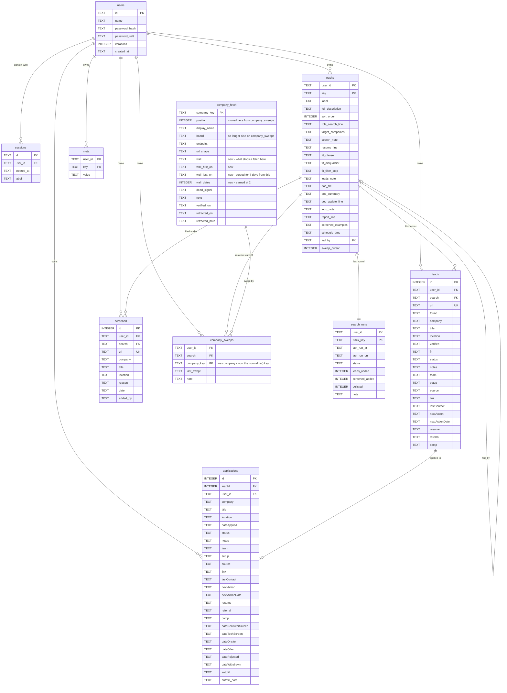

# One company list

There is one list of companies. A search keeps an index into it, not a copy of
it.

## Context

Each search owns its own rotation today, and the four have drifted apart:

```
engineering-management   56      SWE   71
product                  66      CPM   79
```

272 rows covering 139 distinct companies — 1.96x duplication. 22 companies sit
in all four rotations, 49 in two, 59 in exactly one. The same website facts get
written four times into four `note` fields: adding six sports companies on
2026-09-11 wrote NFL's Greenhouse token and Fetch's JS-shell wall into four
copies of user-scoped storage.

The list is global — one list across every person, not one per account.

`COVERAGE_BATCH` goes from 12 to 24. A merged list of 139 at 12 a night is a
12-day cycle; at 24 it is 6, which is where the four rotations sit now.

## The schema

Every table, as it stands after this plan. Three changes are marked; everything
else is today's shape.

There are no `FOREIGN KEY` constraints in this database. The lines below are
relationships the code maintains, not ones SQLite enforces — which is why
`verify-local.mjs` spends most of its checks proving one user's rows cannot
reach another's. `company_sweeps` joins `company_fetch` through
`normalize()` from `exclude.js`, not on a raw string.



`company_fetch` is the only table with no `user_id`. `meta` holds the per-user
prose settings the prompt reads; `sessions` holds bearer tokens.

## The approach

### 1. Membership becomes global

`company_fetch` is the list. It is already global, already keyed by
`company_key`, and already carries `display_name`. It gains one column:

```sql
ALTER TABLE company_fetch ADD COLUMN position INTEGER NOT NULL DEFAULT 0;
```

A company is on the list when it has a row. `position` moves here from
`company_sweeps` so every search's cursor indexes the same log. Assign positions
shuffled, per `0008_sweep_cursor.sql` — a list is typed in alphabetically or
grouped by theme, and position decides who is covered first every cycle and who
is dropped when a run runs short.

Two things follow, and both are behaviour changes rather than renames.

`db.upsertCompanyFetch` refuses to write a row unless it carries a fact
(`board || endpoint || url_shape || dead_signal || note`) — "a typed list is not
evidence". Registering a company is now exactly that write, so the guard becomes
membership-first: create the row, facts optional.

`handleGetCoverage` attaches `known` whenever a row exists. With membership rows
that would hand a run an empty `known` and imply something is known about a
company nothing has looked at yet. Attach it only when a fact field is populated.

### 2. What stays per search

`company_sweeps` keeps `(user_id, search, company_key, last_swept, note)` and
loses `company`, `board` and `position`. `tracks.sweep_cursor` stays as it is —
how far this search has read.

`note` stays, explicitly. It holds what a search learned about a company for
itself — "65 reqs reconfirmed via Greenhouse board, 2 existing tracked leads
still open", "no open backend/SWE roles, reconfirms stable no-roles state" — and
243 of 272 rows carry one, 50,755 characters. It has no other home:
`upsertCompanyFetch` deliberately excludes it because "prose is where a search's
own reasoning leaks", so dropping it here deletes it. Step 9d also tells every
run that `note` "stays on this search's row", which would stop being true.

This resolves issue #2. `board` lives in `company_fetch` only.

### 3. The batch doubles

`COVERAGE_BATCH` 12 → 24, holding the cycle at 6 days.

`0005_company_sweeps.sql` picked 12 as "what one run can actually verify
properly". Runs currently cover 12 in 700–1500s, so 24 is roughly double the
work in a night. Read the run lengths and the sweep counts for the first week
and move the number if runs start finishing short.

Read step 9e before the batch number takes the blame. It re-fetches when
companies in a slice were unreadable, so a bad night compounds on top of 24
rather than 12 — CPM swept 39 across three batches on 2026-09-11 with the batch
still at 12.

### 4. A wall is a shared fact with an expiry

`company_fetch` gains `wall` — what stops a fetch at this company — plus the
three columns that keep it from becoming permanent: `wall_first_on`,
`wall_last_on`, `wall_dates`.

The merge is what makes this urgent. 272 `(search, company)` pairs become
139 × 4, and at a batch of 24 that is 96 company-attempts a night against 48
now, so every wall one rotation holds gets hit by four. 74 rows already record
an obstacle across 45 companies, and about a dozen of those were proved
separately by two or more searches — Alaska Airlines by all four, on four
different dates.

**A wall expires.** `0010`'s own motivating example is three searches
independently recording "Microsoft is robots-blocked", all three wrong for the
same reason — they were testing retired 6-digit ids. Pooled without an expiry
that becomes one confident wrong answer for everybody, which is worse than three
hesitant ones. Google Careers is the same shape: written off as blocked while
serving location and pay range in plain HTML.

The rule is the doc template's fetch-efficiency cadence, moved from prose into
the server:

- a wall counts once it has been recorded on **two separate dates**
  (`wall_dates >= 2`)
- it is served for **seven days** from `wall_last_on`, then stops being served

`handleGetCoverage` omits an unearned or expired wall rather than flagging it.
The run then simply attempts the fetch, which is what a re-test is — no
instruction, and nothing for a run to decide. Reporting a `board` or `endpoint`
for a company clears its wall, since a fetch that worked is the only evidence
that settles it.

Runs already do this per-search and in prose: two of the four Alaska Airlines
notes read "cadence skip — confirmed blocked, within skip window; not
re-tested." The cadence is not new, only the sharing of it.

**What is a wall and what is a note.** The test is what the sentence is about,
not how it is worded. If it would be equally true for a stranger fetching the
same URL, it is a wall: "careers.draftkings.com 403s a plain fetch", "renders a
client-side shell". If it turns on this search's own subject — the role, the
level, the location, this person — it is a note and stays on `company_sweeps`:
"no PM-titled openings besides two Director-level reqs". Both answer "why did I
get nothing here tonight", which is why a run cannot be left to sort them by
feel.

`tracker.ps1`'s `swept` branch whitelists the fields it forwards, so `wall` goes
into that list and into step 9d's array in the same change. A field the API
accepts and the helper drops is a field that does not exist — that is what left
58 of 63 rows with no endpoint for three days.

### 5. Migration

Merge the four rotations into one list of 139, keyed by `normalize()`. Preserve
every search's `last_swept` per company, so no search re-sweeps its whole list
the first night. Set each search's cursor to its position in the new log.

Two facts currently duplicated across four `note` fields move into
`company_fetch` by hand, since they are what the table is for and neither is
there yet:

- NFL — Greenhouse token `nflcareers`, 43 jobs, full JD in the API
- Fetch — `jobs.gem.com/fetch` serves the same 4.8KB JS shell for the board and
  every detail page, no JSON-LD, no `og:description`; `fetch.com/careers/jobs`
  is plain-fetchable at ~2MB and carries titles

## The privacy boundary this changes

`0010_company_fetch.sql` forbids company lists in shared storage: "a person's
target companies are their strategy". That holds while the lists differ. Under
one global list, membership distinguishes nobody — but it is not nothing, and
the header should say what it now is rather than being left to contradict the
schema.

What becomes public is the union. Each person knows what they added, so the
remainder is attributable to "one of the other two" — and better than an even
guess, because the companies are characteristic: a games studio or a
sports-betting company that someone did not add is not a coin flip between two
strangers, and under pooled discovery its presence also says a run surfaced it
recently. Attribution degrades rather than holding.

What does stay scoped is the record of who looked and when: `last_swept`, the
cursor and `note` remain per user and per search. Say it that way in the header.
A rule that overstates its own protection is the kind people rely on.

Amend 0010's header in the same change. A rule that no longer describes the
schema is worse than no rule.

## Files

- `server/migrations/00NN_one_company_list.sql` — `position` added to
  `company_fetch`, `company_sweeps` reduced
- `server/migrations/0010_company_fetch.sql` — header amended
- `server/src/db.js` — `getCoverage`, `recordSweeps`, `setSweepCursor`,
  `countCoverage` against the new shape; `upsertCompanyFetch` writes membership
  without requiring a fact
- `server/src/routes/coverage.js` — `COVERAGE_BATCH`, and the response keeps its
  shape
- `server/README.md` — the coverage contract

## Verification

`verify-local.mjs`: two users' searches draw from the same list, each keeps its
own `last_swept` and cursor, one search sweeping a company does not stamp it for
another, and a company registered by one account appears in another's rotation.

The response shape `{companies, total, batch, cursor}` does not change, so
`./tracker companies` and the prompt's step 1c are untouched.

## Not in scope

Whether a company with a confirmed board should stop consuming a rotation slot.
It would change the revisit rate again and is worth its own decision once the
batch change has a week behind it.

Opening `dead_signal`. It is unreachable for the same reason `wall` needed a
design — `0010` asks for a warning in the prompt that nobody has written — and
the two warnings would be near-identical, which is an argument for doing them
together. They are not the same risk, though. A wrong `wall` costs a skipped
fetch, bounded by the two-date rule, the seven-day expiry, and clearing itself
the moment a fetch succeeds. A wrong `dead_signal` feeds delisting, which
removes rows, and delisting already has to prove itself before it deletes
anything. Same shape, different blast radius, so they do not ship on one
warning. `dead_signal` stays shut.
