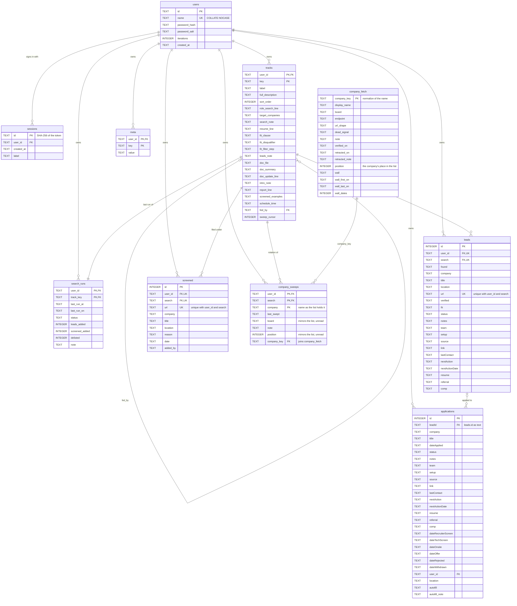

# Schema

The tracker's D1 database as `server/migrations/` builds it: ten tables, from
`0001_schema.sql` through `0011_one_company_list.sql` applied in order. This is the
schema as it exists today. A plan in this folder that changes a table describes
only its change and links here.

## Before reading the columns

Four things hold the schema together that no column name shows.

**There are no foreign keys.** No migration declares a `REFERENCES` constraint.
Every relationship in the diagram — a row's owner, the track it is filed under,
the lead an application came from — is maintained by `server/src/db.js`, which
scopes every statement to the caller's `user_id`. SQLite will accept a row that
points at a user, track or lead that does not exist, or at someone else's. That
is why most of `server/verify-local.mjs` is checks that one user's rows cannot
reach another's.

**Apart from `users` itself, `company_fetch` is the only table with no
`user_id`.** It is the one company list every search indexes into, and it holds
facts about each company's public careers site, shared by every account. What
may be stored in it is set out at the top of
`server/migrations/0010_company_fetch.sql` — a row describes a website, never a
search — and amended by `0011_one_company_list.sql`, which put the list itself
here: membership is visible across the deployment, while the record of who
looked at a company and when stays with each search.

**`company_sweeps` reaches `company_fetch` through `company_key`.**
Both hold `normalize(name)` from `server/src/exclude.js` — lowercased, each run
of characters outside `a-z0-9` replaced by one space, trimmed — so the join is
`company_sweeps.company_key = company_fetch.company_key`.
`company_sweeps.company` still holds a name, but nothing joins on it: comparing
raw strings misses, and `F5, Networks` is stored under `f5 networks`.

**Every other relationship is a value match within one user.**
`leads.search`, `screened.search`, `company_sweeps.search` and
`search_runs.track_key` hold a `tracks.key`; `tracks.fed_by` holds a sibling
track's key. `applications.leadId` holds `leads.id` as text — `''` for an
application added by hand — so the join is `leadId = CAST(leads.id AS TEXT)`.
Each of these also matches on `user_id`, since track keys are only unique per
user.

## Diagram

`PK` and `UK` are constraints SQLite enforces. `FK` marks a column the code
joins on; nothing enforces it.

## Conventions

These hold across every table, so the per-table notes below leave them out.

- Every column outside a primary key is `NOT NULL`. Unset is `''` for text and
  `0` for integers, never `NULL`.
- Columns with no default, which every insert must supply: `users.name`,
  `sessions.user_id`, `tracks.label`, `leads.user_id`, `leads.search`,
  `leads.found`, `leads.company`, `leads.title`, `leads.url`, `leads.verified`,
  `screened.user_id`, `screened.search`, `screened.url`, `screened.date`,
  `applications.dateApplied` and `meta.value`.
- `applications.user_id` is not on that list. `0002_multi_user.sql` added it
  with `ALTER TABLE`, so it defaults to `''`, and an insert that omits it
  succeeds with no owner.
- The only defaults other than `''` and `0` are `leads.status` (`New`),
  `applications.status` (`Applied`) and `users.iterations` (`100000`).
- `leads.id`, `screened.id` and `applications.id` are `AUTOINCREMENT`, unique
  across all users.
- `user_id` has its own index on `sessions`, `leads`, `screened` and
  `applications`. The other user-scoped tables lead their primary key with it.
- The diagram lists columns in the order a database built from empty holds
  them. The live D1 predates `0001_schema.sql` and holds some in a different
  order; nothing reads a column by position.

## Tables

### users

One row per account. `id` is a GUID, and is what every `user_id` holds. `name`
is for login and display only, unique regardless of case. `password_hash` and
`password_salt` are base64 PBKDF2-SHA256; an empty hash means login is disabled.

### sessions

One row per issued bearer token. `id` is the base64 SHA-256 of the token, not
the token. Sessions do not expire; logging out deletes the row. `label` says
where the token lives, such as `browser` or `scheduled-search`.

### tracks

One row per track: a tab on the page and, unless `fed_by` is set, a nightly
search of its own.

- `label`, `full_description` and `sort_order` draw the tab.
- `role_search_line` through `schedule_time` are the search config
  `server/src/prompt.js` composes the prompt from, stored as prose.
  `target_companies` is a JSON array of names; `schedule_time` is local
  `HH:mm`, read by `scripts/setup-scheduler.ps1`.
- `fed_by` names a sibling track whose search fills this tab. A track with it
  set has no search of its own.
- `sweep_cursor` is how far this track's search has read through its
  `company_sweeps` rows, by `position`.

### search_runs

One row per track, created and removed with it when config is saved: the last
run only, not a history. Written by `POST /api/runs`.

- `last_run_at` is an ISO 8601 UTC instant; `last_run_on` is the run's own
  local `YYYY-MM-DD`.
- `status` is `ok` or `error`, and `''` before any run.
- `leads_added`, `screened_added` and `delisted` count that run's work.

### leads

One row per posting a search found and verified live. Unique on
`(user_id, search, url)`; adding leads dedups on that with `INSERT OR IGNORE`.

- `found` and `verified` are `YYYY-MM-DD`: first found, and last confirmed live.
- `status` is one of `LEAD_STATUS` in `server/src/routes/leads.js`.
- `team` through `comp` are the freeform fields shared with `applications`
  (`EXTRA_FIELDS` in `server/src/db.js`).
- A posting confirmed taken down is deleted and its URL written to `screened`,
  unless an application points at the lead, which keeps it.

### screened

One row per posting a search looked at and did not add, so later runs skip it.
Unique on `(user_id, search, url)`, as `leads` is.

- `reason` is free text. A deleted delisted lead leaves the reason
  `posting taken down` (`DELISTED_REASON` in `server/src/db.js`).
- `added_by` is `run` for a row a search wrote, `hand` for a posting a person
  removed from their board, and `''` for older rows that could not be
  attributed (`0007_screened_added_by.sql`). Run records count only `run`.

### applications

One row per job applied to: created when a lead moves to `Applied`, or added by
hand.

- `leadId` is the originating `leads.id` as text, `''` if added by hand.
- `status` is one of `APP_STATUS` in `server/src/routes/applications.js`.
- `team` through `comp` are the same freeform fields as on `leads`.
- `dateRecruiterScreen` through `dateWithdrawn` record when the application
  first reached each stage; `dateApplied` covers `Applied`.
- `location` is copied from the lead when the application is created.
- `autofill` is `''` (not read yet), `filled` or `failed`, with the reason for a
  failure in `autofill_note`. The nightly fill reads rows with a `link`,
  `autofill = ''`, and a blank `company`, `title` or `location`.

### meta

Per-user key/value rows. The keys in use:

- `updated` — the day of the last data change, `YYYY-MM-DD`
- page display: `display_title`, `overview_label`, `applications_label`,
  `all_leads_label`, `stale_run_hours`
- `priority_locations` and `excluded_companies` — JSON arrays
- search prompt prose: `geo_scope_line`, `scope_clause`, `scope_disqualifier`,
  `location_guidance`, `footer_note`, `pronouns`

A setting with no row falls back to `DEFAULT_SETTINGS` in `server/src/db.js`.

### company_sweeps

One search's record of a company on the list: when it last tried it, and what
it learned there. The list itself is `company_fetch`.

- `company_key` is the `normalize()`d name, and is what readers join on,
  through an index on `(user_id, search, company_key)`. `company` is the name
  as the list holds it. Rows written before `0011_one_company_list.sql` can
  hold two spellings of one company for one search; readers take the most
  recently swept.
- `last_swept` is the `YYYY-MM-DD` this search last attempted the company, `''`
  for never. It is a record, and does not choose what runs next.
- `note` is what this search learned about the company, for itself. It never
  travels to `company_fetch`.
- `board` and `position` mirror `company_fetch` and are no longer read. They are
  kept so the worker from before `0011` still runs against this table, until it
  is rebuilt on `company_key`.

### company_fetch

The company list, shared by every account and every search, and what is known
about reaching each company's careers site. A company is on the list when it
has a row here. `company_key` is the `normalize()`d name; `display_name` is the
name as written when the company joined.

- `position` is the company's fixed place in the list, shuffled once and
  appended to as companies join. Every search's `tracks.sweep_cursor` reads
  along it.
- `board` is the JSON job-board kind once confirmed (`greenhouse`, `ashby`,
  `workday cxs`, …). `endpoint` is the slug, host or URL template that reaches
  the board; `url_shape` is the shape of one posting's URL, where the endpoint
  does not imply it.
- `wall` is what stops a fetch at this company. `wall_dates` counts the separate
  dates it was recorded on, from `wall_first_on` to `wall_last_on`. It is served
  only once `wall_dates` reaches 2, and only within seven days of
  `wall_last_on`. A reported `board` or `endpoint` clears it.
- `dead_signal` is what a stated dead posting looks like on this site, `''` for
  no known signal. `scripts/tracker.ps1` does not send it.
- `verified_on` is the `YYYY-MM-DD` a run last confirmed a positive fact about
  the row. Meeting a wall does not move it.
- A row with no facts is membership only, and is not attached to a company as
  `known` when a run is handed its slice.
- A wrong row is retracted, not deleted: `retracted_on` and `retracted_note` are
  set, reads return only the retraction, and runs can no longer update the row.
  A retracted company stays on the list.
